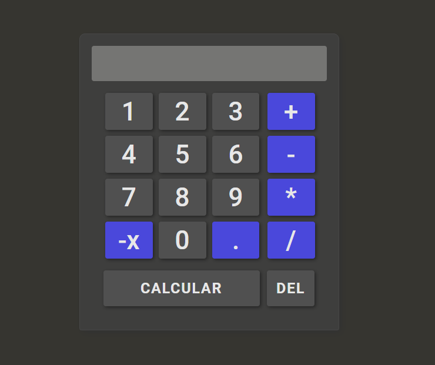

# CALCULADORA

## Funções

    Além das 4 operações matemáticas básicas, é também possivel o uso de números com vírgula e negativos.

<h1 aling="center">
    
</h1>

## Veja o site dinamicamente

<a href="https://viteydev.github.io/Calculadora/">Calculadora</a>
